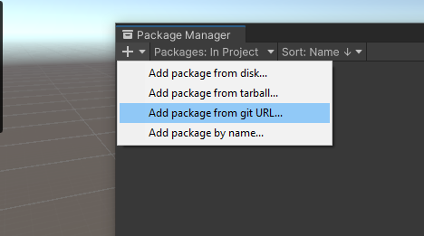
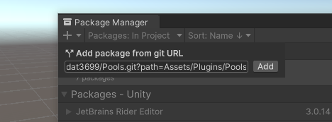
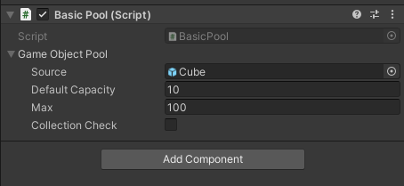
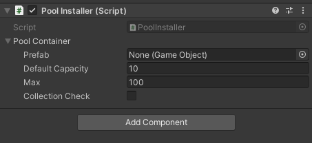

# Object Pooling for Unity


## Feature
- Based on unity's built-in [ObjectPool](https://docs.unity3d.com/ScriptReference/Pool.ObjectPool_1.html)
- Easy to use
- Easy to integrate with already written spawn systems
- Callbacks OnGet & OnRelease to reset object's state
- Can Create and get pool using Prefab reference like Instantiate() method

## How to Install
Install via git URL:
```
https://github.com/tiendat3699/Pools.git?path=Assets/Plugins/Pools
```



## Usage
### Basic way to get pool:
#### Create pool and get object
```csharp
using Pools.Runtime;
using UnityEngine;

public class BasicPool : MonoBehaviour
{
    //Create pool
    public Pool<GameObject> GameObjectPool;

    void Start()
    {
        //Get object from pool
        var obj1 = GameObjectPool.Get();
        var obj2 = GameObjectPool.Get(new Vector3(0, 0, 0), Quaternion.identity);
        var obj3 = GameObjectPool.Get();
    }
}
```

You can configure which gameobject you want to use in the inspector



Also, you can use pool for other object type (type must be convertible to 'UnityEngine.Object' )
```csharp
public class BasicPool : MonoBehaviour
{
    ...
    public Pool<ParticleSystem> ParticlePool;
    public Pool<CustomType> CustomTypePool;
    ...
}

public class CustomType: MonoBehaviour
{
    public int Value;
    ...
}
```

#### Clear pool
```csharp
public class BasicPool : MonoBehaviour
{
    public Pool<GameObject> GameObjectPool;
    public Pool<ParticleSystem> ParticlePool;
    public Pool<CustomType> CustomTypePool;

    private void OnDestroy()
    {
        //clear pool
        GameObjectPool.Clear();
        ParticlePool.Clear();
        CustomTypePool.Clear();
    }
}
```

#### Release object
```csharp
public class BasicPool : MonoBehaviour
{
    public Pool<GameObject> GameObjectPool;

    private void Start()
    {
        var instance1  = GameObjectPool.Get();
        //release using extension from instance
        instance1.Release();
        var instance2  = GameObjectPool.Get();
        //release using Release method from pool
        GameObjectPool.Release(instance2);
    }
}
```
#### Using OnGet & OnRelease
OnGet & OnRelease will be automatically called when inheriting from IPoolable

```csharp
public class CustomType: MonoBehaviour, IPoolable
{
    public int Value;
    
    public void OnGet()
    {
        //reset Value
        Value = 0;
    }

    public void OnRelease()
    {
        //do something when release
    }
}
```

### Create Pool using prefab reference:
With Pools you can using prefab reference to get object from pool like using Instantiate() method of Unity 

```csharp
//BasicPool.cs
public class PoolInstaller : MonoBehaviour
{
    public GameObject Prefab;
    public int DefaultCapacity;
    public int Max;
    public bool CollectionCheck;

    private void Start()
    {
        //create pool from prefab
        Pool<GameObject>.CreatePrefabPool(Prefab, DefaultCapacity, Max, CollectionCheck);
    }
    
    private void Spawn() {
        //get object from pool
        var obj =Prefab.Get();
    }
}
```

Then, you can get pool in other script by using prefab reference
```csharp
//OtherScript.sc
public class OtherScript: MonoBehaviour
{
    public GameObject Prefab;

    private void Start()
    {
        //make sure Pool<GameObject>.CreatePrefabPool() called before use this
        var obj = Prefab.Get();
    }
}
```

Also, you can use PoolContainer<T> for fast config prefab reference Pool

```csharp
public class PoolInstaller : MonoBehaviour
{
    public PoolContainer<GameObject> PoolContainer;

    void Start()
    {
        //create
        PoolContainer.Create();
    }

    private void OnDestroy()
    {
        //clear
        PoolContainer.Clear();
    }
}
```


### PoolHelper
This is an extension that helps you quickly perform some methods with the pool through a prefab or instance created from the pool without going through the pool, for example: GetPool(), Release(), Get()

```csharp
GetPool()
Get()
Get(Transform parent, bool worldPositionStays = true)
Get(Vector3 position, Quaternion rotation)
Get(Vector3 position, Quaternion rotation, Transform parent)
Release()
```


